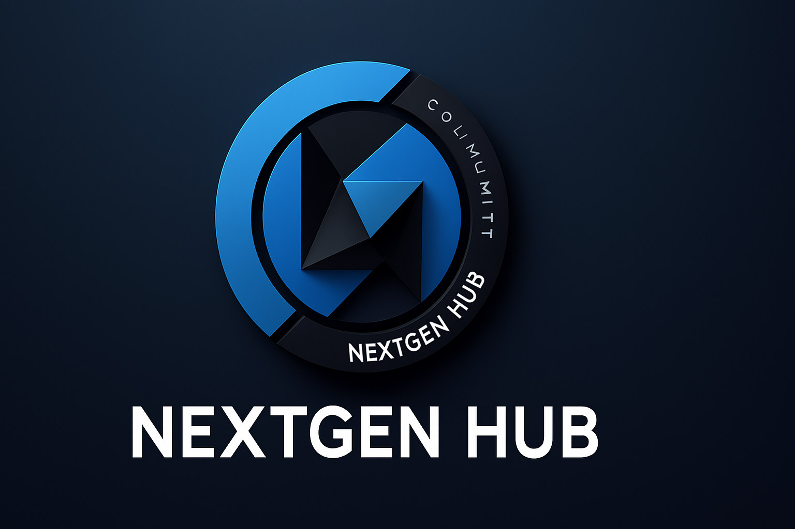
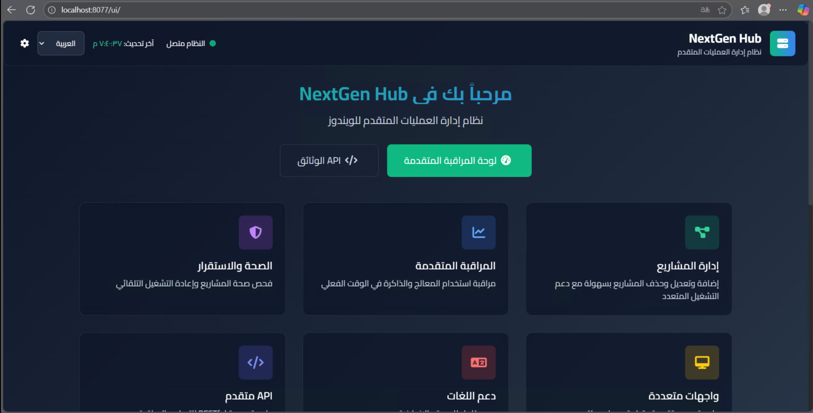
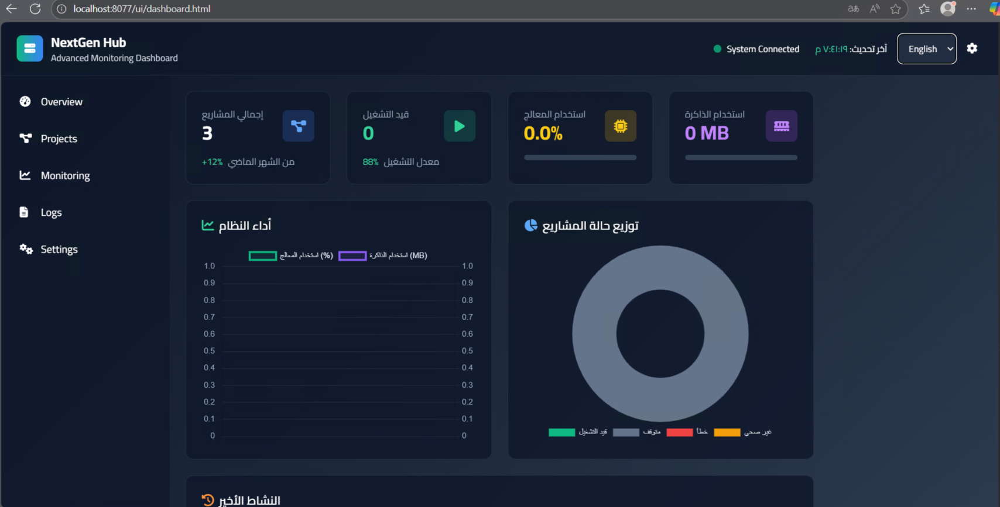
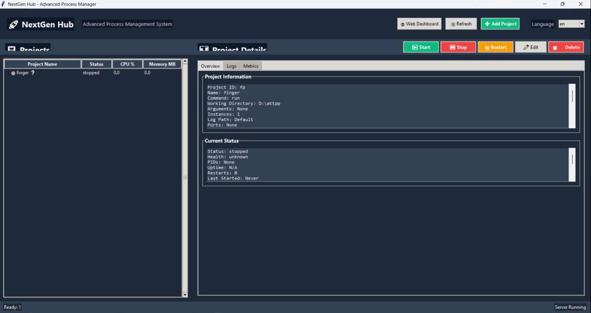

## NextGen Hub - Advanced Process Management System

### 🚀 نظام متقدم لإدارة عمليات تطبيقات بايثون على ويندوز (Web + Desktop)

[](assets/logo.png)

- Repository Owner: [KishoOoOoOo](https://github.com/KishoOoOoOo)
- Community & Support: [Discord](https://discord.gg/dQZmKCjM)

---

### نظرة عامة | Overview

- العربية: نظام NextGen Hub هو منصة لإدارة وتشغيل ومراقبة عمليات التطبيقات على ويندوز، مع واجهة ويب تفاعلية وتطبيق سطح مكتب. يدعم تشغيل عدة نسخ من المشروع، مراقبة الموارد، فحوصات الصحة، وإعادة التشغيل التلقائي.
- English: NextGen Hub is a Windows-focused process management and monitoring platform with a modern Web dashboard and a Desktop app. It supports multi-instance projects, resource monitoring, health checks, and automatic restarts.

---

## ✨ الميزات الرئيسية | Key Features

| الميزة | Feature | الوصف | Description |
|--------|---------|-------|-------------|
| **إدارة المشاريع** | **Project Management** | إضافة/تعديل/حذف مشاريع مع دعم تشغيل متعدد النسخ | Add/edit/delete projects, multi-instance support |
| **مراقبة حية** | **Real-time Monitoring** | تتبع CPU/RAM والعمليات، زمن التشغيل، والخيوط | Live CPU/RAM, threads, uptime |
| **فحوصات الصحة** | **Health Checks** | HTTP/TCP/Process مع إعادة تشغيل تلقائي | HTTP/TCP/Process checks with autorestart |
| **واجهات متعددة** | **Multi-Interface** | واجهة ويب + تطبيق سطح مكتب + REST API | Web UI + Desktop App + REST API |
| **اللغة** | **Language** | واجهة عربية/إنجليزية مع تبديل فوري | Arabic/English with instant switch |
| **سجلات وتشخيص** | **Logs & Diagnostics** | قراءة آخر السطور من سجلات المشروع | Tail recent logs per project |

> ملاحظة: توزيع الحمل يتم عبر تشغيل نسخ متعددة من المشروع. لا يوجد Load Balancer بروتوكولي منفصل داخل هذا الإصدار، ولكن يمكن التعامل مع التوزيع عبر الطبقة الأمامية (NGINX/Reverse Proxy) عند الحاجة.

---

## 🧑‍💻 التثبيت والتشغيل | Install & Run

### المتطلبات | Requirements
- Windows 10/11
- Python 3.11+
- PowerShell

### الاستنساخ والتثبيت | Clone & Install
```powershell
# في مجلد العمل
git clone https://github.com/KishoOoOoOo/nextgen-hub.git
cd nextgen-hub

# تثبيت التبعيات
python -m pip install --upgrade pip
pip install -r manager/backend/requirements.txt
```

### تشغيل خادم الويب | Run Web Server
```powershell
# من الجذر
python -m uvicorn manager.backend.app:app --host 127.0.0.1 --port 8077

# المتصفح
# Web Dashboard: http://127.0.0.1:8077/ui/dashboard.html
# Health:        http://127.0.0.1:8077/healthz
```

### تشغيل تطبيق سطح المكتب | Run Desktop App
```powershell
cd manager
python desktop_app.py
```

> إن كان المنفذ 8000 مستخدماً على جهازك، استخدم 8077 كما في المثال بالأعلى.

---

## 📍 نقاط الوصول | Access Points

| الواجهة | Interface | الرابط | URL |
|---------|-----------|--------|-----|
| لوحة الويب | Web Dashboard | http://127.0.0.1:8077/ui/dashboard.html | Web |
| صحة الخادم | Health | http://127.0.0.1:8077/healthz | JSON |
| قائمة المشاريع | Projects API | http://127.0.0.1:8077/api/projects | JSON |

---

## 🖼️ لقطات الشاشة | Screenshots

> ضع الصور في مسار `assets/` بالأسماء التالية أو عدّل المسارات هنا:

- شعار المشروع | Project Logo
  - `assets/logo.png`
- واجهة الويب | Web Interface
  - `assets/web.png`
  
  

- إدارة المشاريع | Projects View
  - `assets/proj.png`
  
  

- تطبيق سطح المكتب | Desktop App
  - `assets/prog.png`
  
  

---

## ⚙️ أمثلة التكوين | Configuration Examples

### تكوين مشروع | Project Configuration (YAML)
```yaml
id: "my-app"
name: "تطبيق بايثون"
working_dir: "C:/path/to/app"
command: "python"
args: ["app.py"]
instances: 2
log_path: "logs/app.log"
ports: [8000]
description: "My Python service"
env:
  ENV: "production"
  DEBUG: "false"
healthcheck:
  type: "process"  # http, tcp, process, none
restart_policy:
  autorestart: true
  restart_delay_seconds: 5
  max_restarts_per_hour: 10
```

> يمكن إضافة المشاريع من الويب أو من تطبيق سطح المكتب. الويب يتحقق من وجود `working_dir` على الخادم قبل الحفظ.

---

## 🧩 هيكل المشروع | Project Structure

```text
manager/
├─ backend/
│  ├─ app.py             # FastAPI server (REST + WebSocket + Static UI)
│  ├─ process_manager.py # Start/stop/status/metrics (psutil)
│  ├─ orchestrator.py    # Periodic status/metrics/health + broadcast
│  ├─ models.py          # Pydantic models
│  ├─ health.py          # HTTP/TCP/Process health checks
│  ├─ project_store.py   # YAML-backed projects store
│  └─ static/
│     ├─ dashboard.html  # Web dashboard
│     ├─ dashboard.js    # UI behavior + WS + REST
│     └─ dashboard.css   # Styling
├─ desktop_app.py        # Tkinter Desktop UI (ar/en)
├─ data/
│  ├─ projects.yaml      # User projects (ignored by git)
│  └─ projects.example.yaml
└─ backend/requirements.txt
```

---

## 🧪 اختبار | Testing
```powershell
cd manager
pytest -v
# الحالة الحالية: جميع الاختبارات تمر (25 passed)
```

---

## 🐳 Docker (اختياري)
```powershell
cd manager
# بناء
docker build -t nextgen-hub .
# تشغيل
docker run -p 8000:8000 nextgen-hub
# http://127.0.0.1:8000/ui/dashboard.html
```

أو باستخدام docker-compose:
```powershell
cd manager
docker-compose up -d
```

---

## 🤝 المساهمة | Contribution

1. Fork المستودع
2. أنشئ فرعًا جديدًا: `git checkout -b feature/awesome`
3. نفّذ التغييرات + الاختبارات
4. `git commit -m "Add awesome feature"`
5. `git push origin feature/awesome`
6. افتح Pull Request

> يتوفر CI على GitHub Actions (انظر `.github/workflows/ci.yml`).

---

## 📜 الترخيص | License

MIT License. راجع ملف `LICENSE` في الجذر.

---

## 🆘 الدعم | Support
- GitHub Profile: [@KishoOoOoOo](https://github.com/KishoOoOoOo)
- Discord: [Join Community](https://discord.gg/dQZmKCjM)

> إذا واجهت مشكلة، افتح **Issue** موضحاً خطوات إعادة الإنتاج، وأرفق سجلات الخطأ إن أمكن. 